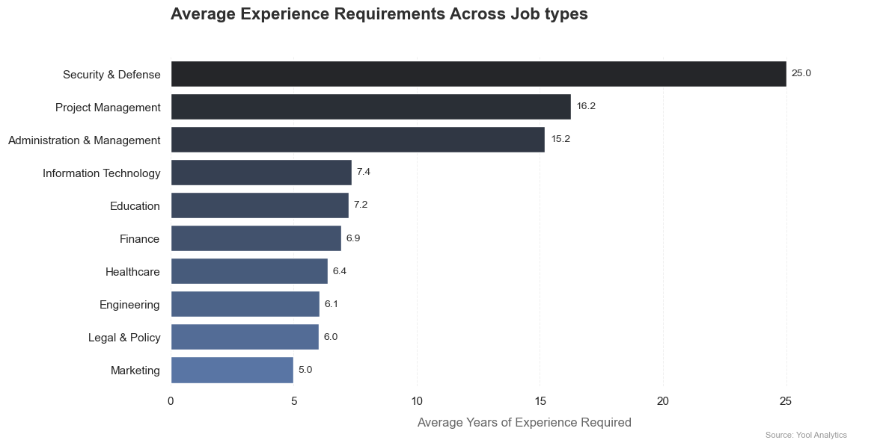
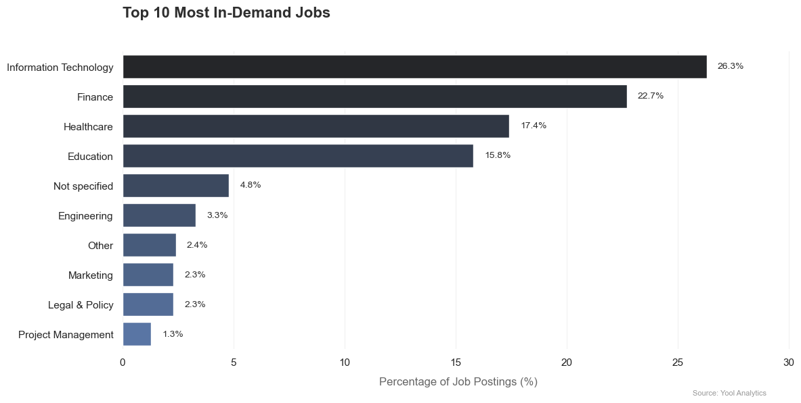
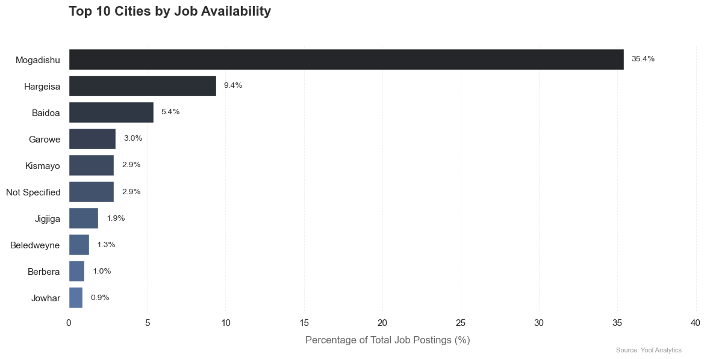
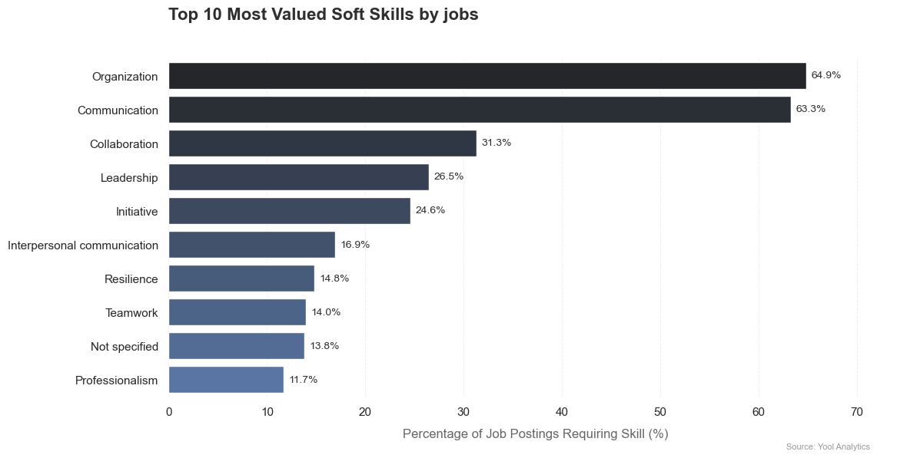
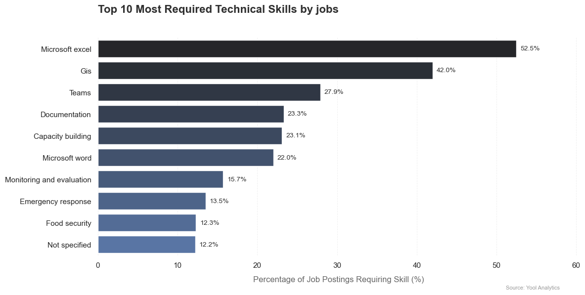
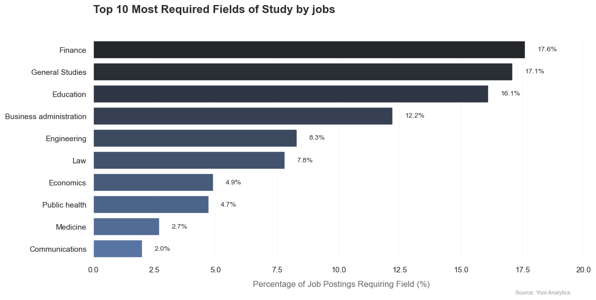
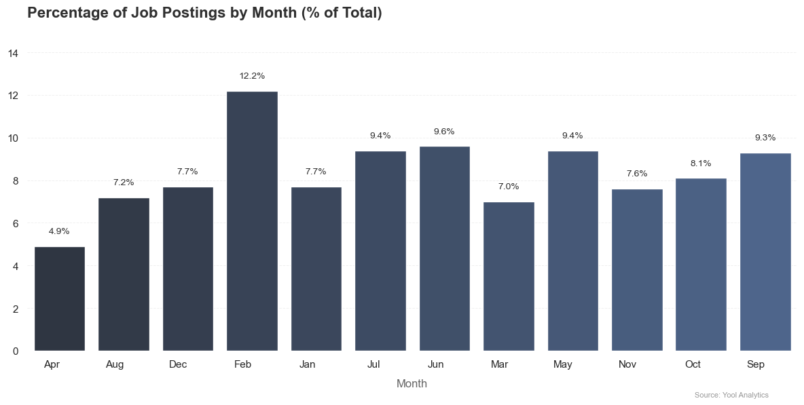

## **The Somali Job Market: Key Insights and Trends from Qaranjobs.com**

### Introduction

The Somali job market is undergoing significant transformation, shaped by economic trends, international development efforts, and evolving skill demands. To better understand employment patterns, we scraped and analyzed job postings from **Qaranjobs.com**. This report presents a structured analysis of employer needs, required skills, education preferences, and hiring cycles, providing job seekers, employers, and policymakers with actionable recommendations.

Our analysis reveals key trends across various dimensions, including experience requirements, job demand, location-based hiring, soft and technical skill needs, and education levels. Below, we break down these insights and provide data-driven recommendations.

---

### Key Insights

#### 1. Experience Requirements Vary Significantly by Sector

 

- **Security & Defense roles demand the highest experience levels**, averaging **25 years**, far exceeding all other fields. These roles likely require highly specialized expertise and come with significant risk factors.
- **Project Management (16.2 years) and Administration & Management (15.2 years) follow closely**, reflecting the seniority and leadership responsibilities associated with these positions.
- **Technology (7.4 years), Education (7.2 years), and Finance (6.9 years) require moderate experience levels**, suggesting a mix of technical expertise and professional experience.
- **Marketing requires the least experience (5.0 years)**, likely due to the field’s adaptability and the rapid evolution of digital marketing skills.

#### 2. Information Technology, Finance, and Healthcare Are the Most In-Demand Fields

- **Information Technology leads job demand (26.3%)**, highlighting the increasing reliance on digital expertise and technological advancements.
- **Finance (22.7%) and Healthcare (17.4%) follow closely**, reflecting demand for financial analysts, accountants, medical professionals, and health administrators.
- **Education (15.8%) remains a strong hiring sector**, driven by the need for teachers, trainers, and academic professionals.
- **Engineering (3.3%), Marketing (2.3%), and Legal & Policy (2.3%) have relatively lower job postings**, suggesting more competitive job markets in these fields.

#### 3. Mogadishu Dominates Job Availability

- **Mogadishu accounts for 35.4% of job postings**, making it the dominant employment hub, likely due to economic activity, government institutions, and business concentration.
- **Hargeisa (9.4%) and Baidoa (5.4%) serve as secondary job centers**, while cities such as Garowe (3.0%), Kismayo (2.9%), and Jigjiga (1.9%) have moderate employment levels.
- **Smaller cities like Beledweyne (1.3%), Berbera (1.0%), and Jowhar (0.9%) offer fewer job opportunities**, likely tied to specific industries or regional economic activity.

#### 4. Organizational and Communication Skills Are the Most Valued Soft Skills

- **Organization (64.9%) and Communication (63.3%) are the top soft skills employers seek**, emphasizing efficiency and clear messaging across industries.
- **Collaboration (31.3%) and Leadership (26.5%) highlight the importance of teamwork and decision-making abilities.**
- **Initiative (24.6%), Interpersonal Communication (16.9%), and Resilience (14.8%) further differentiate strong candidates.**
- **Teamwork (14.0%) and Professionalism (11.7%) remain relevant but less frequently highlighted in job postings.**

#### 5. Microsoft Excel and GIS Are the Most Required Technical Skills

 

- **Microsoft Excel (52.5%) remains the most sought-after skill**, underscoring its significance in data analysis, finance, and administrative tasks.
- **GIS (42.0%) ranks second**, signaling strong demand in urban planning, environmental analysis, and disaster management.
- **Teams (27.9%), Documentation (23.3%), and Capacity Building (23.1%) highlight the importance of digital collaboration and structured reporting.**
- **Monitoring & Evaluation (15.7%) and Emergency Response (13.5%) suggest a focus on performance tracking and crisis management.**

#### 6. Finance and Education Are the Most Required Fields of Study

 

- **Finance (17.6%) and General Studies (17.1%) lead job requirements, followed closely by Education (16.1%).**
- **Business Administration (12.2%) and Engineering (8.3%) show consistent demand across industries.**
- **Law (7.8%), Economics (4.9%), and Public Health (4.7%) highlight niche but significant employment sectors.**

#### 7. Hiring Peaks in February

 

- **February sees the highest job postings (12.2%)**, likely driven by new budget cycles and workforce planning.
- **Hiring remains strong in June (9.6%), July (9.4%), and September (9.3%)**, suggesting mid-year employment demand.
- **April (4.9%) records the lowest hiring activity**, indicating seasonal employment slowdowns.

---

### Recommendations

- **Job seekers should develop strong bilingual communication skills in Somali and English**, as nearly all job postings require them.
- **Employers should implement language training programs** to enhance workforce multilingual capabilities.
- **Government agencies and policymakers should expand vocational training and certification programs** to meet workforce needs.
- **Tech professionals should focus on Excel, GIS, and data analysis skills**, as these remain the most in-demand technical competencies.
- **Candidates should time their job applications to peak hiring months** (February, June, July, and September) for the best opportunities.
- **The private sector should be strengthened to balance NGO and government job reliance**, creating more stable employment.

---

### Conclusion: Adapting to a Dynamic Job Market

The Somali job market is evolving rapidly, with technology, finance, and healthcare sectors leading job demand. Experience levels vary significantly by industry, with leadership roles requiring over a decade of expertise, while fields like marketing offer faster entry points. Somali and English proficiency are non-negotiable for most roles, reinforcing the need for bilingual communication skills. 

To remain competitive, job seekers should focus on **developing technical skills, gaining experience in high-demand industries, and strategically timing job applications.** Employers must prioritize **upskilling initiatives and talent development**, while policymakers should **enhance vocational training and expand employment opportunities beyond NGO-driven roles.**

---

### **Resources & Methodology**

- **[Scraping Notebook](scraping-notebook-link)** – Details on data extraction from Qaranjobs.com.
- **[Cleaning Notebook](cleaning-notebook-link)** – Steps for structuring and preparing data for analysis.
- **[Analysis Notebook](analysis-notebook-link)** – Code and insights derived from the processed job data.

This report provides a **data-driven perspective on Somalia’s evolving job market**, equipping job seekers, employers, and policymakers with actionable insights to enhance workforce development.

